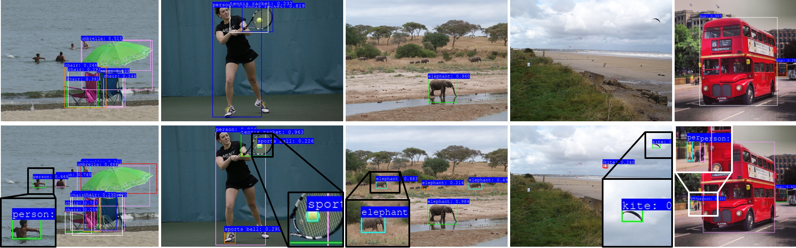

# Small Object Detection - BMVC 2019
Repository for our work on small object detection to be presented at BMVC 2019.

This repo builds on the excellent SSD repository [ssds.pytorch](https://github.com/ShuangXieIrene/ssds.pytorch). Huge shoutout.



### Table of Contents
- <a href='#installation'>Installation</a>
- <a href='#usage'>Usage</a>
- <a href='#performance'>Performance and Model Zoo</a>
- <a href='#todo'>Future Work</a>
- <a href='#reference'>Reference</a>

## Installation
Compatible with Pytorch 1.0.0 and Python 3.5

1. Create a virtual environment by `python3 -m venv venv1`
2. Source the virtual environment by `source venv1/bin/activate`
3. Install requirements by `pip3 install -r ./requirements.txt`
4. mkdir data
5. mkdir data/COCO
6. Add a shortcut to the COCO images and annotations folder in the local COCO folder e.g. `ln -s <coco_source>/images data/COCO/images`
7. Compile pyococotools by `cd lib/utils; make`
8. Compile gpu NMS by `cd lib; make`

## Usage
To train, test and demo some specific model. Please run the relative file in folder with the model configure file, like:

`python3 train.py --cfg=./experiments/mobilenetv1/ssd_lite_dual_mobilenetv1_train_coco_S1L0_Split.yml`

Change the configure file based on the note in [config_parse.py](./lib/utils/config_parse.py)

## Performance

| COCO2017                                                                          | mAP(small)| mAP(medium)| mAP(large)| mAP(overall)|
|-----------------------------------------------------------------------------------|-----------|------------|-----------|-------------|
| [VGG16](https://drive.google.com/open?id=1Bkt_nZW4fe_UrLyPOVltq0C7cTpABlQI)       |6.9        |27.9        |40.3       |24.6         |
| [MobilenetV1](https://drive.google.com/file/d/1yBpd3aIDvlK2j7HxsNj8kJuASTCaN5Bo) |1.8        |19.1        |36.3       |18.8         |
| [MobilenetV1-S1L0](https://gtvault-my.sharepoint.com/:u:/g/personal/bmudassar3_gatech_edu/EWFdH4ivbg1ItcNMU4BeoasBigQk_PvzzRoc4QxCHpooWQ?e=r6GYx0) |7.9        |25.2        |28.6       |19.6         |
| [MobilenetV1-S1L0 Dualpath-Split](https://gtvault-my.sharepoint.com/:u:/g/personal/bmudassar3_gatech_edu/ETnwvzTw0UxAjfVCKy27GWcBVqta38WORkDnGDpAgouFcQ?e=9WLtA5) |8.2        |25.0        |30.8       |20.7         |
| [VGG16-S1L2](https://gtvault-my.sharepoint.com/:u:/g/personal/bmudassar3_gatech_edu/EbAtKQCFUuNNoK7Q6c6wEvwB0k1yNXZuyQiRqYuSpc9RAg?e=kp7qwv)       |11.2        |27.3        |33.4       |23.7         |
| [VGG16-S1L2 Dualpath-Split](https://gtvault-my.sharepoint.com/:u:/g/personal/bmudassar3_gatech_edu/ER21bzQqbS5Psd4cqzI27LIBjzCp0Lf6ezKIdQcT-zmtDg?e=MBhrL9)       |13.7        |31.4        |41.3       |28.5         |

| Net InferTime* (fp32) | SSD     |
|-----------------------|---------|
| MobilenetV1           | 6.9ms   |
| MobilenetV1-S1L0      | 12.1ms  |
| VGG16                 | 12.1ms  |
| VGG16-S1L2 Dualpath   | 31.1ms  |


## TODO
- speed up post-processing for COCO testing

## Reference

If you find our work useful, please don't forget to cite.
```
    @inproceedings{mudassar2019rethinking,
      title={Rethinking Convolutional Feature Extraction for Small Object Detection},
      author={Mudassar, Burhan A and Mukhopadhyay, Saibal},
      booktitle={British Machine Vision Conference (BMVC)},
      year={2019}
    }
```
